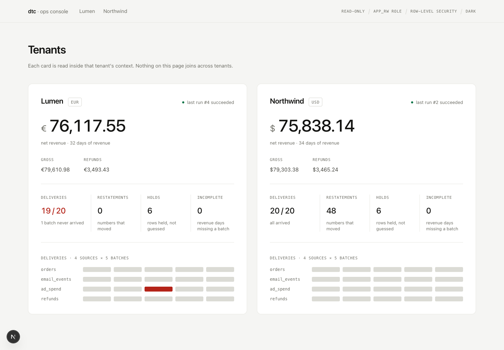
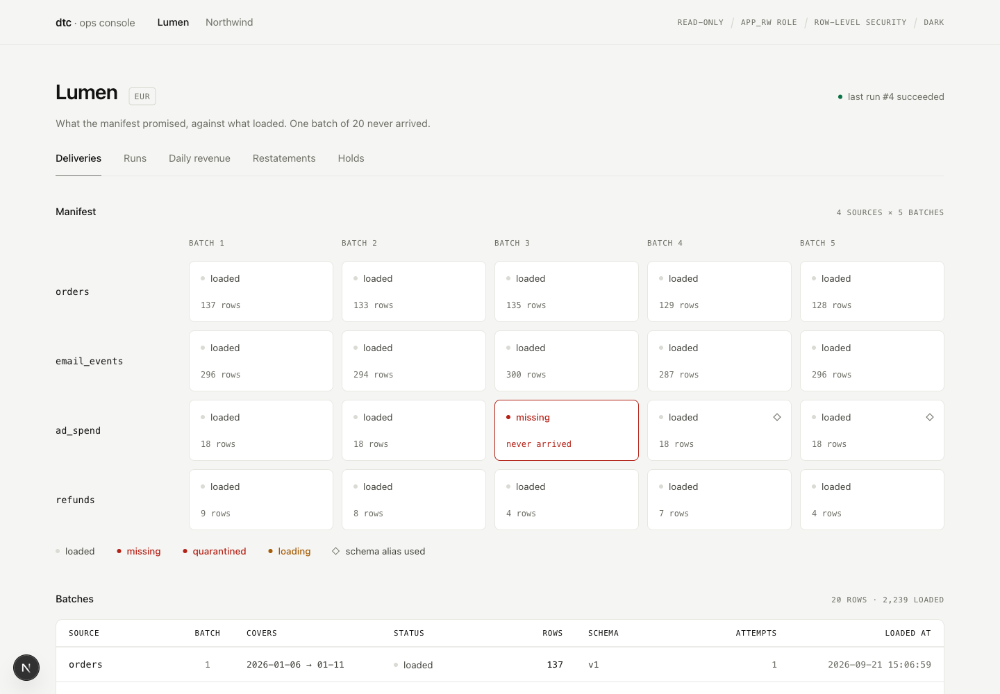
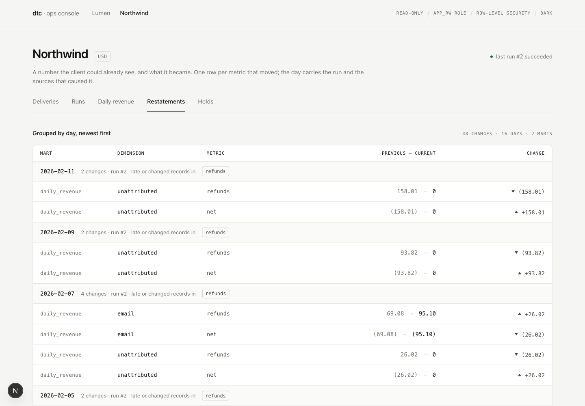
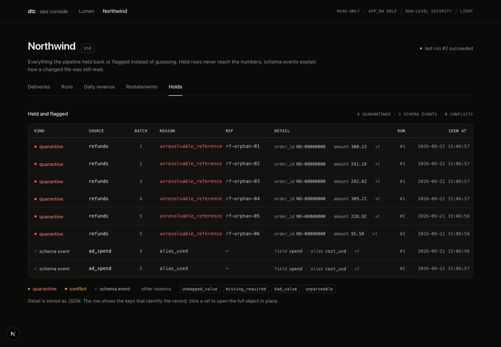

# dtc-ingestion

[](https://github.com/farchojob/dtc-ingestion/actions/workflows/ci.yml)

The ingestion and modelling layer for a direct-to-consumer brand's data stack: storefront orders, email events, ad spend and refunds, for any number of tenants, into Postgres, with the failures real sources produce handled on purpose: a run that dies halfway, the same file twice, a column renamed mid-series, records for a day that was already reported.

TypeScript and Postgres. One `npm install`, one Docker container, no ORM.

Read in this order: this file (what it does, how to run it), `TRADEOFFS.md` (what was prioritised, what was left, what a third client costs), `docs/FINDINGS.md` (what is wrong with the fixtures, measured), `docs/DECISIONS.md` (every design choice with what it rejected), `docs/QUESTIONS.md` (what only the client can settle, written as it would be sent), `docs/ONBOARDING.md` (adding a client without reading the code).

## Run it from a clean checkout

Prerequisites: Node 20 or newer, Docker with Compose. Port 5433 for Postgres and 4010 for the console must be free.

```bash
git clone https://github.com/farchojob/dtc-ingestion.git && cd dtc-ingestion
cp .env.example .env
npm install
npm run db:up            # Postgres 16 in Docker, waits until healthy
npm run migrate          # schemas, tables, the app role, row-level security
npm run ingest -- --tenant northwind
npm run ingest -- --tenant lumen
npm run check:deliveries # exit 1: lumen/ad_spend/batch_03 never arrived
npm test                 # 7 tests against a separate database, ~10 s
npm run console          # http://localhost:4010
```

Every command can be run again. The second `ingest` of the same files loads nothing, changes nothing, restates nothing, and says so.

To see every failure mode at once, replay the deliveries the way they arrived:

```bash
npm run demo             # reset, migrate, northwind batches 1-4, then batch 5 (late records), lumen crashed mid-file, then resumed
npm run console
```

The same commands run on every push in GitHub Actions against a fresh Postgres (`.github/workflows/ci.yml`), including the smoke run and the delivery check that is expected to fail for lumen.

## What it does

```
fixtures/<tenant>/<source>/batch_NN.*       csv or ndjson, as exports land
        │  ingest   sha256 per file · rows in 100-row transactions · resumable after a crash
      raw ────────  raw.file_loads · raw.records (JSONB, one row per line)
        │  stage    column aliases from config · typing · per-tenant normalisation · upsert by natural key
      stg ────────  stg.orders · stg.email_events · stg.ad_spend · stg.refunds
        │  marts    only the days that changed · previous numbers kept in ops.restatements
     mart ────────  mart.daily_revenue (day × channel) · mart.daily_email (day × campaign) · mart.daily_marketing
```

Around it: `ops.runs` (every invocation and its stats), `ops.expected_deliveries` (the manifest, loaded), `ops.quarantine` (rows and files held with a reason), `ops.schema_events` (aliases used, unknown columns), `ops.conflicts` (a record re-delivered with different content), `ops.dirty_days`, `ops.restatements`.

## The commands

| Command | What it does |
|---|---|
| `npm run ingest -- --tenant <id>` | ingest → stage → marts → delivery check, and print the run report |
| `npm run ingest -- --tenant <id> --batches 1-4` | only those batch numbers: replay deliveries in the order they arrived |
| `npm run ingest -- --tenant <id> --crash-after-rows 500` | die after 500 rows, mid-transaction; the next run resumes from the last committed chunk |
| `npm run demo` | reset the database and replay both tenants in delivery order, with the crash and the late batch |
| `npm run dtc -- ingest\|stage\|marts --tenant <id>` | one phase at a time |
| `npm run check:deliveries` | every batch the manifest promises vs what loaded, all tenants; exit 1 if any is missing |
| `npm run check:finance -- --tenant <id>` | the client's `finance_summary.csv` against the marts, day by day |
| `npm run dtc -- tenant validate <file>` | validate a tenant YAML before it touches anything |
| `npm run dtc -- tenant list` | tenants the config knows about |
| `npm run console` | the read-only console at :4010: deliveries, runs, daily revenue, restatements, holds, per tenant |

## What to look at in the run report

After `npm run ingest -- --tenant northwind`:

- `orders`: 694 rows loaded, 680 inserted, 14 unchanged. Batch 3 re-delivers 14 rows of batch 2; they count once.
- `ad_spend` batches 4 and 5: schema `spend=cost_usd`. The column was renamed; the declared alias was used and a schema event recorded.
- `marts`: 6 orphan refunds. Their `order_id` points at nothing; they are in quarantine and in the `unattributed` line of daily revenue.

After `npm run ingest -- --tenant northwind --batches 1-4` and then a full run:

- `restatements: 48`. Batch 5 carries 24 email events for 12 to 17 January (already built), refunds for days already built, and the orders that let refunds which had been `unattributed` find their channel. Each moved metric has a row in `ops.restatements` with the previous value, the new one, the run, and the cause.

After `npm run ingest -- --tenant lumen`:

- `expected but not arrived: ad_spend batch 3`. Those six days have `spend = NULL` and `complete = false` in `mart.daily_marketing`, not zero.

## The console

`npm run console` serves a read-only console at http://localhost:4010: one card per tenant, then deliveries, runs, daily revenue, restatements and holds per tenant. It is server-rendered Next.js with shadcn/ui, reads through the same `withTenant()` as the pipeline (as `app_rw`, under row-level security), and ships no client JavaScript beyond navigation. Light and dark are both authored; the switch is a link that sets a cookie.

| | |
|---|---|
|  |  |
|  |  |

## Tenancy

Every table has `tenant_id`. Row-level security is enabled and forced on all of them; the application role (`app_rw`) cannot bypass it; the only database entry point in the code is `withTenant(tenantId, fn)`, which sets `app.tenant_id` for one transaction. A query with no tenant context returns no rows; an insert for another tenant is refused by the policy. The console reads through the same helper. `tests/pipeline.test.ts` proves all four. There is no `if (tenant === ...)` in the code: `grep -rn "northwind\|lumen" packages/pipeline/src` returns nothing.

Adding a client is a YAML file: `docs/ONBOARDING.md`.

## What is finished and what is not

Finished and tested: ingestion with file and record idempotency, crash and resume, schema drift by declared alias with quarantine of the unknown, late arrivals with restatements, the delivery check, tenant isolation, the daily revenue and daily email marts, the finance reconciliation check, the console.

Sketched or not built, with the reasoning in `TRADEOFFS.md`: attribution between email campaigns and ad spend (the ids do not join), a scheduler or watcher (runs are invoked), currency conversion (each tenant reports in its own currency), per-chunk lookups in staging (it loads the tenant's existing keys per file, fine at this size), a policy other than "restate" for late arrivals.

## Layout

```
config/sources/*.yaml        what each source looks like, once (fields, accepted column names, natural key)
config/tenants/*.yaml        what differs per client; _template.yaml for the next one
packages/pipeline/           the service: src/, migrations/, tests/
apps/ops-console/            Next.js + shadcn/ui, read-only
fixtures/                    the task materials, untouched
docs/                        FINDINGS, PLAN, DECISIONS, QUESTIONS, ONBOARDING
.github/workflows/ci.yml     install, migrate, test, smoke-run and build on every push
```
